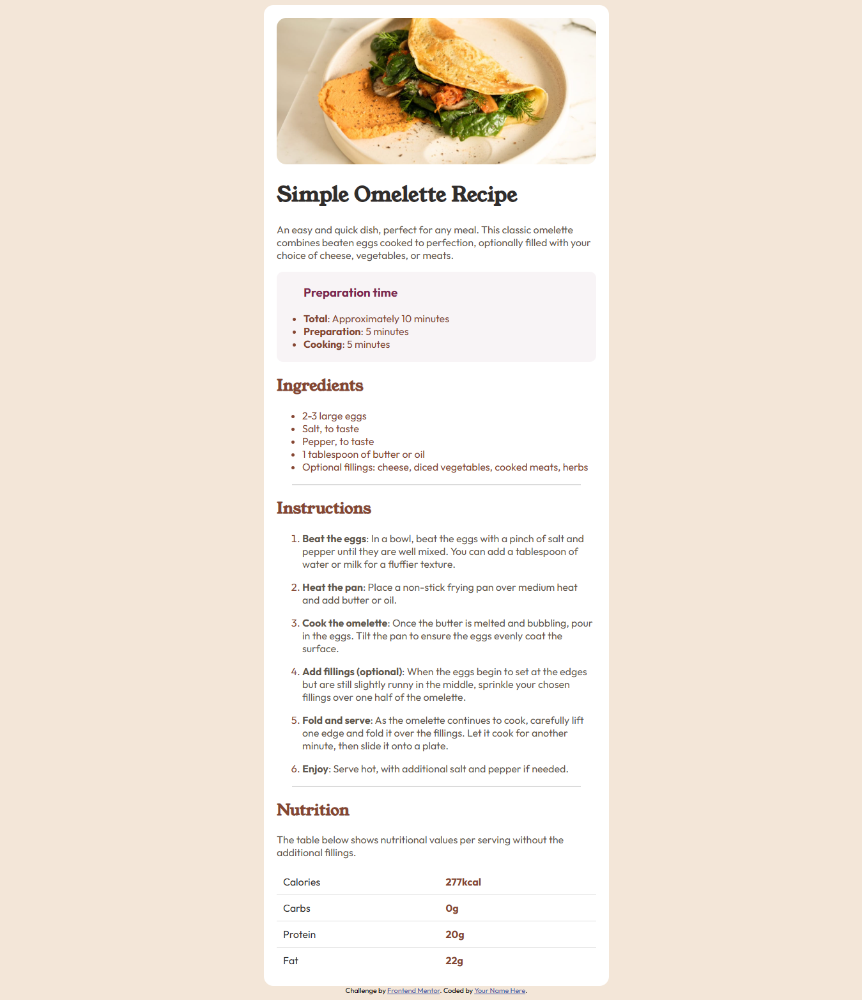

# Frontend Mentor - Recipe page solution

This is a solution to the [Recipe page challenge on Frontend Mentor](https://www.frontendmentor.io/challenges/recipe-page-KiTsR8QQKm). Frontend Mentor challenges help you improve your coding skills by building realistic projects. 

## Overview

### Screenshot

### Links

- Solution URL: [solution URL](https://github.com/FarisahHannes2210/omelette-recipe-frontend-mentor)
- Live Site URL: [Live Site URL](https://FarisahHannes2210.github.io/omelette-recipe-frontend-mentor)

## Author

- Frontend Mentor - [@FarisahHannes2210](https://www.frontendmentor.io/profile/FarisahHannes2210)

